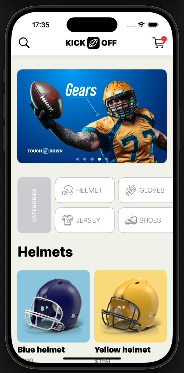
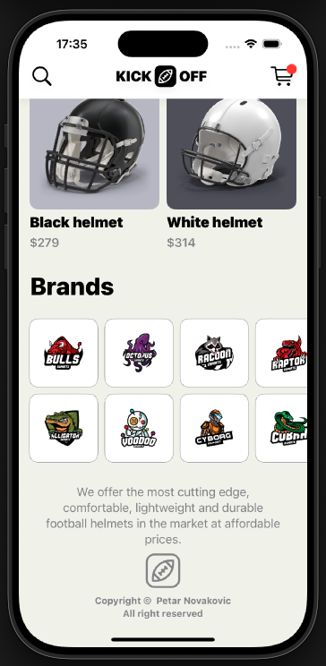
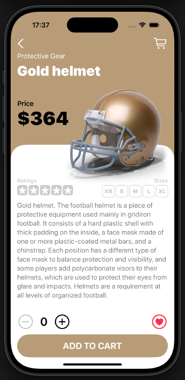
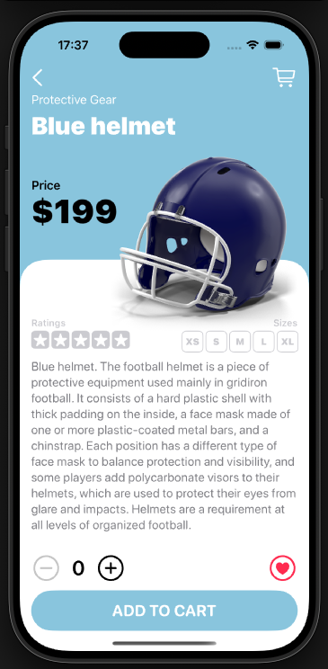

# KickOff
KickOff iOS app covering:

  -  SwiftUI – Declarative UI framework for building modern iOS apps.
  -  MVC Architecture – Code structured into Model, View, and Controller layers.
  -  Rapid Prototyping – Fast UI/UX creation for early presentation and feedback.
  -  SwiftUI Animations – Smooth and elegant animation effects.
  -  Haptic Feedback – Precise and responsive vibration effects.

📌 Note: No external dependencies – Just download and build.

📸 Screenshots

<table>
  <tr>
    <td></td>
    <td></td>
    <td></td>
    <td></td>
  </tr>
</table>
